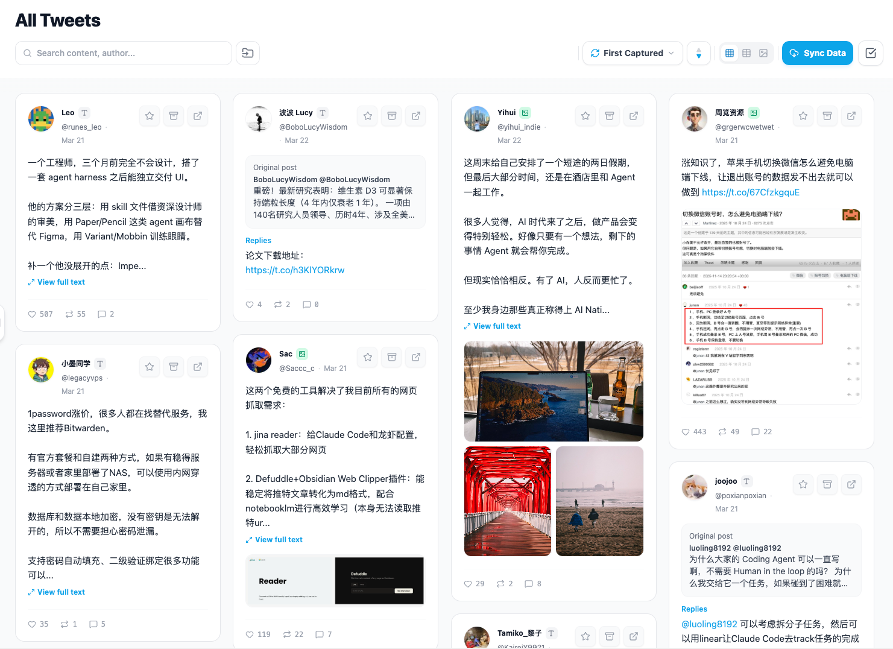
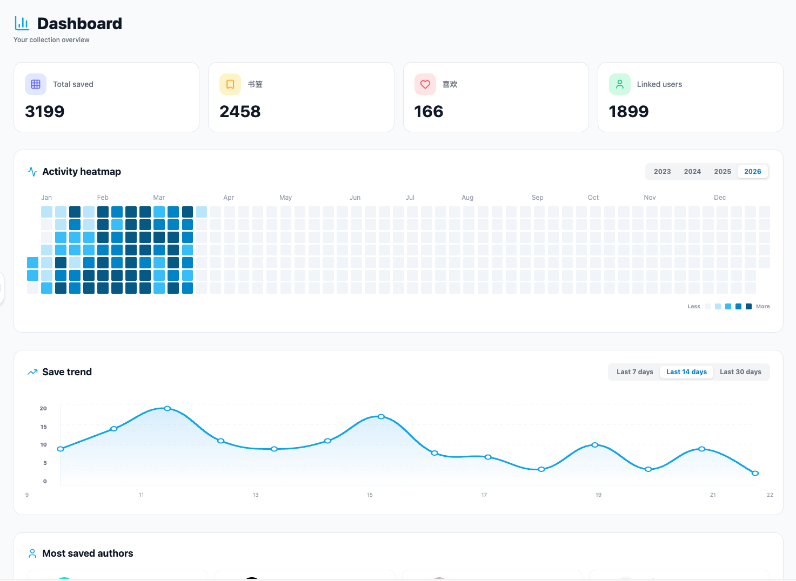
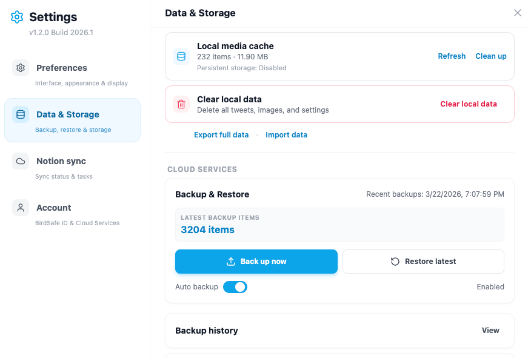
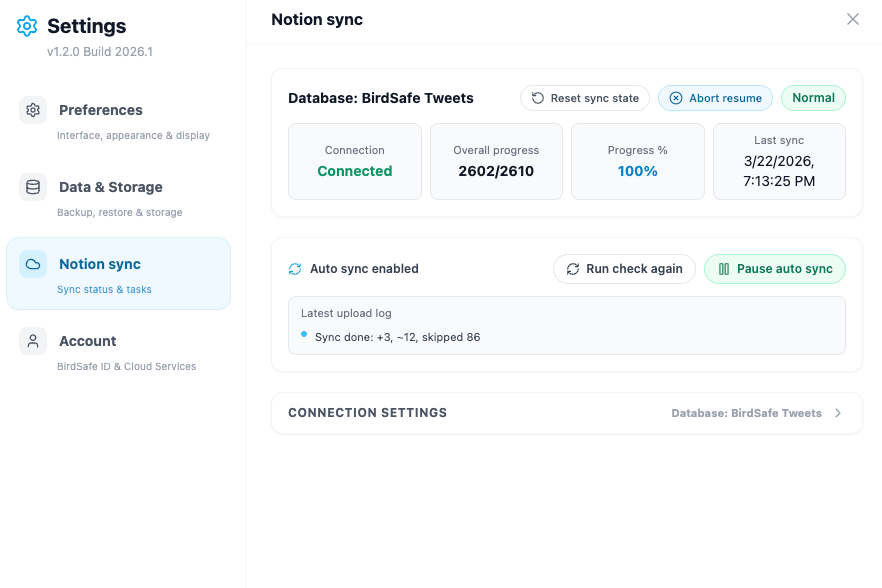
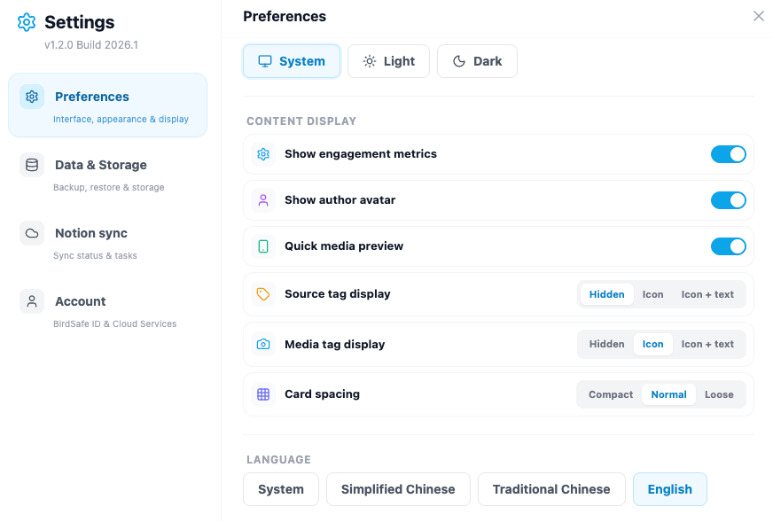

# BirdSafe

English | [简体中文](./README.zh-CN.md) | [繁體中文](./README.zh-TW.md)

A local-first Chrome extension for backing up and managing your Twitter/X bookmarks and likes.

BirdSafe intercepts Twitter's native API responses to capture your saved content, including bookmarks, likes, threads, and media, then stores everything in a local IndexedDB database that you control. No data leaves your browser unless you explicitly enable cloud features.

## Download

- Latest release: [GitHub Releases](https://github.com/duyananbryce/birdsafe-extension-releases/releases)
- Current package: [BirdSafe-extension-v2026.03.22.zip](https://github.com/duyananbryce/birdsafe-extension-releases/releases/download/v2026.03.22/BirdSafe-extension-v2026.03.22.zip)

## Install

1. Download the latest `BirdSafe-extension-*.zip` package from [Releases](https://github.com/duyananbryce/birdsafe-extension-releases/releases).
2. Unzip it locally.
3. Open `chrome://extensions` in a Chromium-based browser.
4. Enable `Developer mode`.
5. Click `Load unpacked`.
6. Select the extracted `dist` folder.

## Features

### Core

- Local-first storage with IndexedDB via Dexie.js
- Network interception of Twitter/X GraphQL responses
- Smart incremental sync to reduce duplicate fetches
- Deep sync mode for historical backfill
- Silent backfill for long text, thread context, profiles, and thumbnails
- Rate-limit aware request queue with automatic cooldown on HTTP 429

### Browse and Organize

- Waterfall, table, and gallery view modes
- Full-text local search across tweet text and author names
- Advanced filters by media type, date range, and source
- Folders, stars, and archive workflows
- Batch operations for move, archive, and folder assignment
- Random mode for resurfacing older saves
- Tweet detail modal with full text, media preview, and manual refresh

### Dashboard

- Stats cards for total saves, bookmarks, likes, and linked authors
- Activity heatmap
- Trend chart for recent save activity
- Top authors leaderboard with one-click filtering

### Account Monitor

- Public timeline capture for any `@handle` or profile URL
- Noise cleaning for reply-thread-heavy timelines
- Per-account export to JSON, CSV, and Excel

### Cloud Features

Optional cloud features require login.

- Encrypted cloud backup with restore points
- Real-time media mirroring to Cloudflare R2
- Notion sync with validation, resume checkpoints, retries, and long-content splitting

## Privacy and Security

- Local-first by design: tweet content, media cache, and metadata stay in the browser unless cloud features are enabled
- Credentials stay local: `ct0` and `auth_token` cookies are used only for local request assembly
- Minimal permissions: the extension only requests permissions it actively uses
- Cloud encryption: cloud backup data is encrypted before upload

## Notes

- This is a release distribution repository, not a public source repository.
- Release assets are provided for installation and update delivery.
- All rights reserved unless explicitly stated otherwise.
