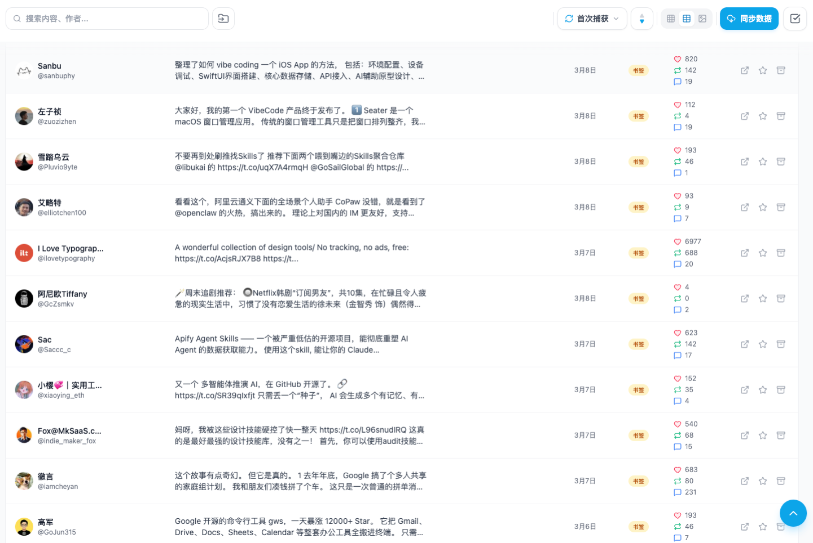
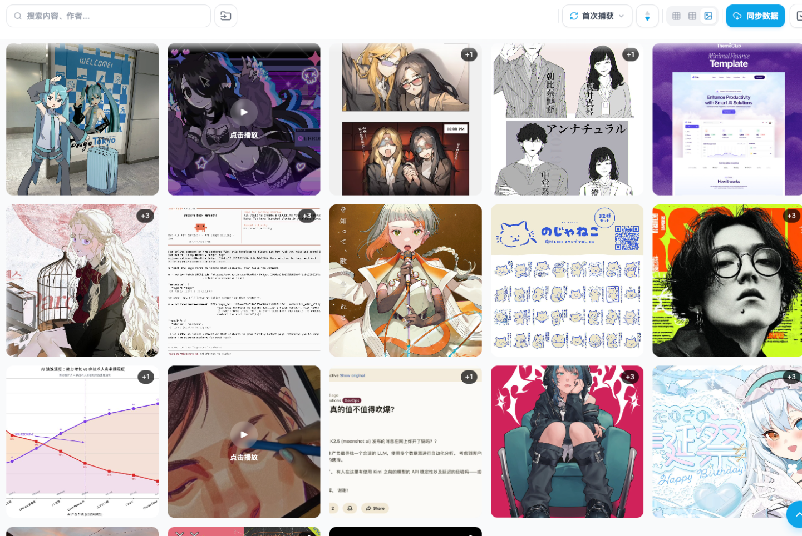
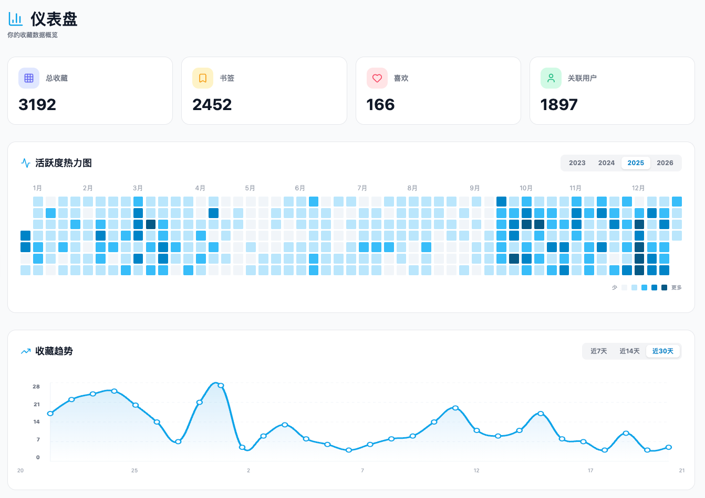
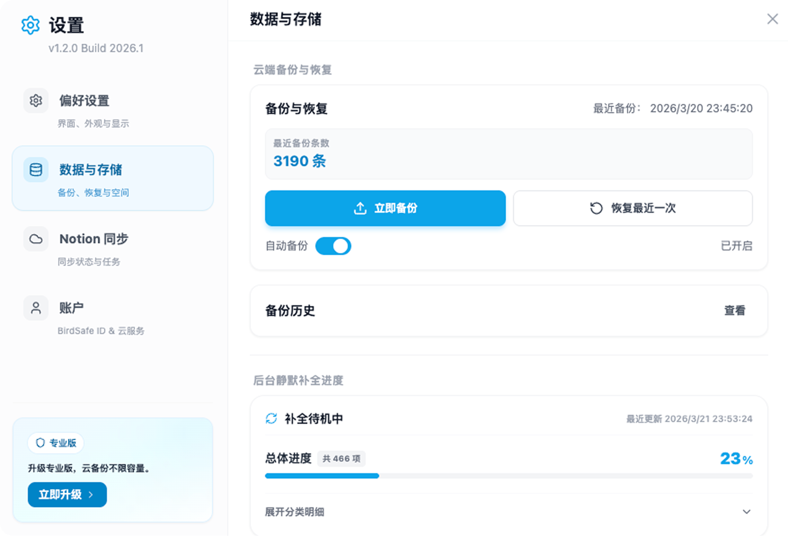
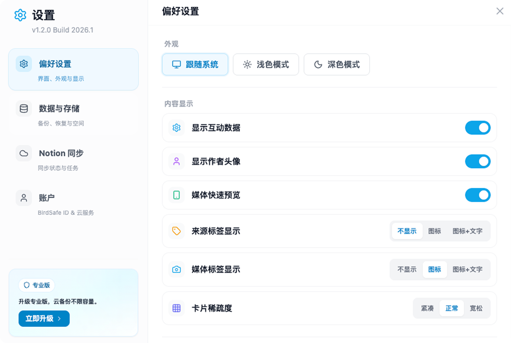

# BirdSafe

[English](./README.md) | [简体中文](./README.zh-CN.md) | 繁體中文

**一款本地優先的 Chrome 瀏覽器擴充功能，用於備份和管理你的 Twitter/X 書籤與喜歡。**

你在 Twitter/X 上的書籤和喜歡隨時可能消失，可能是因為博主刪帖、帳號被封或演算法調整。BirdSafe 在你的瀏覽器中保留一份永久、可搜尋的本地副本，完全由你掌控。除非你主動啟用雲端功能，否則資料不會離開你的瀏覽器。

[官網](https://birdsafe.nan0.in) · [使用文件](https://birdsafe.nan0.in/docs) · [更新日誌](https://birdsafe.nan0.in/changelog)

---

## 功能特性

### 同步與備份

- **一鍵同步**：點擊一次，拉取全部書籤和喜歡。智慧增量同步，斷點續傳。
- **深度同步**：常規同步遺漏較早內容時，可強制執行完整歷史拉取。
- **背景自動補全**：自動修補缺失的長推文全文、回覆上下文、推文串、作者資料和影片封面。
- **安全節流**：內建請求頻控與自動冷卻機制，保障帳號安全。

### 瀏覽與整理

- **三種檢視模式**：瀑布流、表格、圖庫，自適應欄寬佈局。
- **全文搜尋**：按推文內容和作者名稱即時本地檢索。
- **進階篩選**：按媒體類型、時間範圍、來源（書籤 / 喜歡）過濾。
- **資料夾、星標、封存**：自訂資料夾整理內容，星標重要內容，封存暫不需要的內容。
- **批次操作**：多選後批次移動、封存或分配資料夾。
- **隨機模式**：重新發現被遺忘的收藏。
- **推文詳情彈窗**：全文檢視、內嵌影片播放、圖片燈箱、推文串視覺化。

### 儀表板

- **統計卡片**：總收藏數、書籤數、喜歡數、關聯作者數一目了然。
- **活躍熱力圖**：按年切換的貢獻熱力圖。
- **趨勢圖**：7 / 14 / 30 天新增趨勢折線圖。
- **作者榜單**：排行榜，點擊可直接按作者過濾內容。

### 雲端功能（可選，需登入）

- **加密雲端備份**：手動或自動備份，支援按版本還原。
- **即時媒體鏡像**：圖片和影片非同步上傳至雲端，即使原推被刪除也能保留原始媒體。
- **Notion 同步**：同步到 Notion 資料庫，支援欄位校驗、斷點續傳、長內容自動拆分。

---

## 快速上手

1. 從 [Chrome Web Store](#)（即將上線）安裝 BirdSafe。
2. 確保在同一瀏覽器中已登入 [x.com](https://x.com)。
3. 點擊工具列中的 BirdSafe 圖示開啟面板。
4. 點擊 **同步** 開始拉取你的書籤和喜歡。

就這麼簡單。資料儲存在你的瀏覽器本地，核心功能無需註冊帳號。

---

## 隱私與安全

- **本地優先設計。** 所有內容儲存在瀏覽器中，除非你啟用雲端功能，否則不會上傳任何資料。
- **憑據不外傳。** 認證 Cookie 僅用於在本地組裝 API 請求，絕不會傳送到任何第三方伺服器。
- **最小權限。** 擴充功能僅申請實際使用的權限，宿主權限僅限 `x.com` / `twitter.com`。
- **雲端加密。** 啟用雲端備份時，資料在上傳前會進行加密。

詳情請參閱 [隱私政策](https://birdsafe.nan0.in/privacy)、[服務條款](https://birdsafe.nan0.in/terms) 和 [安全審計](https://birdsafe.nan0.in/security-audit)。

---

## 版本方案

| | **免費版** | **Pro 版** |
| --- | --- | --- |
| 本地存檔 | 最多 1,500 條 | 無限制 |
| 搜尋與篩選 | 基礎 | 完整 |
| 檢視模式 | 瀑布流、表格、圖庫 | 瀑布流、表格、圖庫 |
| 匯出 | Markdown / JSON | Markdown / JSON |
| 加密雲端備份 | - | 1 GB |
| Notion 同步 | - | 包含 |
| 本地媒體快取 | - | 高清原圖全量快取 |

[查看完整定價方案](https://birdsafe.nan0.in/#pricing)

---

## 相關連結

- [官方網站](https://birdsafe.nan0.in)
- [使用文件](https://birdsafe.nan0.in/docs)
- [更新日誌](https://birdsafe.nan0.in/changelog)
- [隱私政策](https://birdsafe.nan0.in/privacy)
- [服務條款](https://birdsafe.nan0.in/terms)
- [安全審計](https://birdsafe.nan0.in/security-audit)

---

## 授權條款

BirdSafe 為專有軟體，保留所有權利。使用條款詳見 [服務條款](https://birdsafe.nan0.in/terms)。
